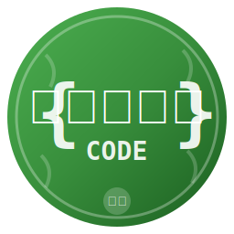

# BanglaCode - VS Code Extension

**BanglaCode** is a Bengali-syntax programming language extension for Visual Studio Code. Created by **Ankan** from **West Bengal, India**.



## Features

### ✨ Syntax Highlighting
Full syntax highlighting for all BanglaCode keywords, built-in functions, strings, numbers, and comments.


### 🔧 IntelliSense & Code Completion
- **Keywords**: `dhoro`, `jodi`, `kaj`, `ferao`, etc.
- **Built-in Functions**: All 40+ Banglish functions with descriptions
- **User-defined Variables**: Auto-detected from your code
- **User-defined Functions**: Auto-detected from your code
- **Classes**: Auto-detected from your code

### 📝 Snippets
Quick snippets for common patterns:
- `dhoro` → Variable declaration
- `jodi` → If statement
- `ghuriye` → For loop
- `kaj` → Function definition
- `class` → Class definition
- `chesta` → Try-catch block
- `server` → HTTP server template
- And many more!

### 📚 Hover Documentation
Hover over any keyword or built-in function to see:
- Bengali meaning (বাংলা অর্থ)
- Description
- Usage examples

### 🎨 File Icons
Custom `.bang` file icon that makes your BanglaCode files easily recognizable.

## Installation

### From VSIX (Local Installation)

1. Package the extension:
   ```bash
   cd VSCode_Extension
   npm install
   npx vsce package
   ```

2. Install in VS Code:
   - Press `Ctrl+Shift+P`
   - Type "Install from VSIX"
   - Select the generated `.vsix` file

### Manual Installation

1. Copy the `VSCode_Extension` folder to:
   - **Windows**: `%USERPROFILE%\.vscode\extensions\banglacode`
   - **macOS/Linux**: `~/.vscode/extensions/banglacode`

2. Restart VS Code

## Usage

1. Create a new file with `.bang` extension
2. Start typing! IntelliSense will help you

### Quick Start

```banglacode
// Hello World in BanglaCode
dekho("Namaskar, West Bengal!");

// Variables
dhoro naam = "Ankan";
dhoro boyosh = 25;

// Function
kaj greet(name) {
    dekho("Hello,", name);
}

greet(naam);
```

## Keywords

| Keyword | Bengali | Meaning |
|---------|---------|---------|
| `dhoro` | ধরো | Variable declaration |
| `jodi` | যদি | If |
| `nahole` | নাহলে | Else |
| `jotokkhon` | যতক্ষণ | While |
| `ghuriye` | ঘুরিয়ে | For loop |
| `kaj` | কাজ | Function |
| `ferao` | ফেরাও | Return |
| `class` | ক্লাস | Class |
| `notun` | নতুন | New |
| `sotti` | সত্যি | True |
| `mittha` | মিথ্যা | False |
| `khali` | খালি | Null |
| `chesta` | চেষ্টা | Try |
| `dhoro_bhul` | ধরো ভুল | Catch |
| `felo` | ফেলো | Throw |

## Built-in Functions

All function names are in **pure Banglish** (Bengali words in English script):

| Function | Bengali | Purpose |
|----------|---------|---------|
| `dekho()` | দেখো | Print |
| `dorghyo()` | দৈর্ঘ্য | Length |
| `dhokao()` | ঢোকাও | Push |
| `berKoro()` | বের করো | Pop |
| `borgomul()` | বর্গমূল | Square root |
| `boroHater()` | বড় হাতের | Uppercase |
| `chotoHater()` | ছোট হাতের | Lowercase |
| `server_chalu()` | সার্ভার চালু | Start server |
| ... | | [See full list in SYNTAX.md] |

## Snippets

Type these prefixes and press Tab:

- `dhoro` - Variable declaration
- `jodi` - If statement
- `jodi-nahole` - If-else
- `ghuriye` - For loop
- `jotokkhon` - While loop
- `kaj` - Function
- `class` - Class definition
- `chesta` - Try-catch
- `ano` - Import
- `pathao-kaj` - Export function
- `server` - HTTP server template
- `main` - Main program template

## Requirements

- Visual Studio Code 1.74.0 or higher
- BanglaCode interpreter (optional, for running code)

## Extension Settings

This extension contributes:
- Language support for `.bang` files
- Syntax highlighting
- Code completion
- Snippets
- Hover documentation
- File icons

## Known Issues

None at the moment. Please report issues on GitHub!

## Release Notes

### 1.0.0

Initial release:
- Full syntax highlighting
- IntelliSense for all keywords and built-in functions
- 35+ code snippets
- Hover documentation
- Custom file icons

## About

**BanglaCode** was created to make programming accessible to Bengali speakers, especially students who think in Bengali but need to write code.

> *"আমি একজন বাংলা মাধ্যমের ছাত্র। আমি logic তৈরি করতে পারি, কিন্তু সেই logic validate করতে Programming language এর syntax শিখতে হয়।"*
>
> *"I am a Bengali medium student. I can create logic, but to validate that logic I need to learn programming language syntax."*
>
> — **Ankan**, Creator

---

**Made with ❤️ in West Bengal, India**
